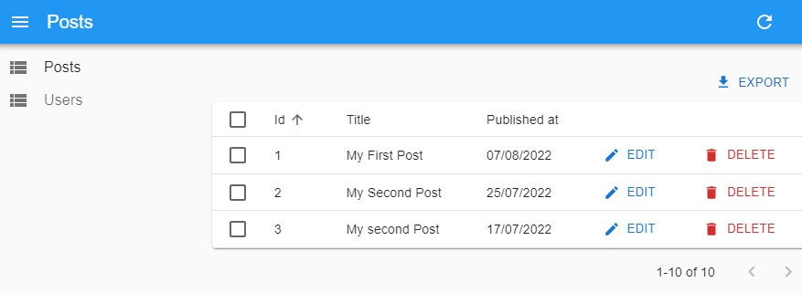

# Admin Dashboard

- Simple admin dashboard with [React Admin](https://marmelab.com/react-admin/Readme.html) framework and [React Admin](https://github.com/typicode/json-server) library to fake a REST API

## Run

git clone > npm i

- npm run dev: server side and client side simultaneously
- npm run client - Port 3000
- npm run server - Port 5000

## Main Steps

- Root folder

  - npm i json-server
  - npx create-react-app client
  - npm i concurrently
    - Add:
      "scripts": {
      - "server": "json-server --watch db.json --port 5000",
      - "client": "npm start --prefix client",
      - "dev": "concurrently \"npm run server\" \"npm run client\" "
        }
    - middleware.js to manage CORS
    - db.json database to seed the project

- Client folder
  - npm i react-admin ra-data-simple-rest
  - npm install @material-ui/core --legacy-peer-deps
  - Add: "proxy": "http://localhost:5000"

## Image

General view  

